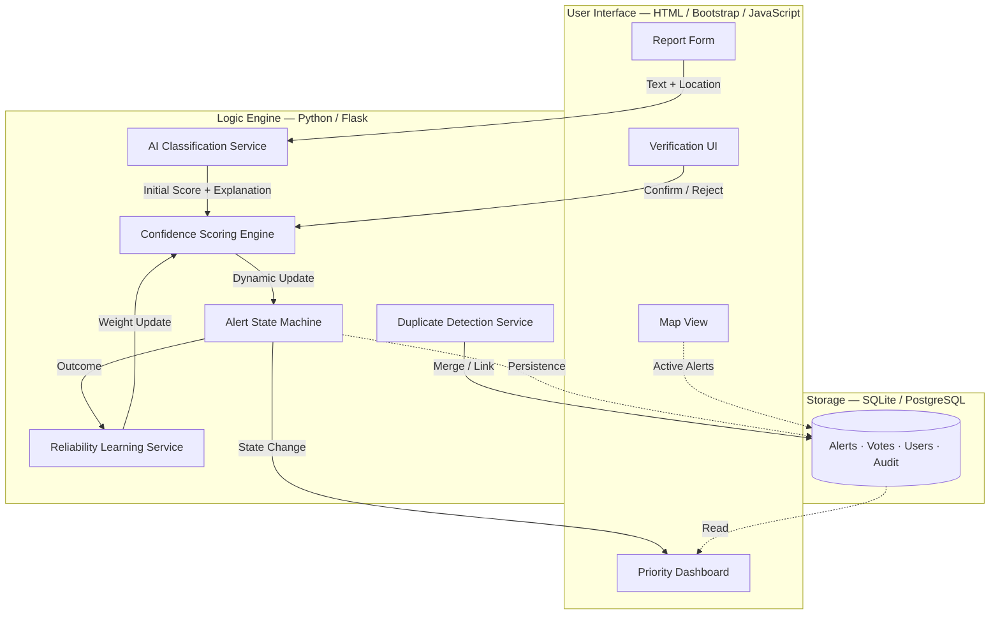

<p align="center">
  
</p>

<h1 align="center">CrisisSignal AI — Rapid Crisis Response Intelligence Platform</h1>

<p align="center">
  <strong>Technical System Design Document &amp; Submission Overview</strong><br/>
  GDG Solution Challenge 2026 — Open Innovation Track
</p>

<p align="center">
  <code>Document Version 3.0 — Final Unified Edition</code>
</p>

---

## Table of Contents

| § | Section | Description |
|:---:|---|---|
| 1 | [Executive Summary](#1-executive-summary) | One-paragraph pitch, key features, and competitive thesis |
| 2 | [Problem Statement](#2-problem-statement) | Concrete failure scenarios, stakeholder pain, and structural gaps |
| 3 | [Proposed Solution](#3-proposed-solution) | Three-pillar architecture, step-by-step resolution of each failure |
| 4 | [System Architecture](#4-system-architecture) | Component overview, module responsibilities, technology stack |
| 5 | [End-to-End Workflow](#5-end-to-end-workflow) | Complete data flow from user input to resolution and audit |
| 6 | [Core Features — Base System](#6-core-features--base-system) | Reporting, classification, severity, confidence, dashboard, audit |
| 7 | [Advanced Features — Trust Intelligence Layer](#7-advanced-features--trust-intelligence-layer) | Crowd verification, dynamic confidence, reliability scoring, state machine, X-Logic, duplicate detection, role-based views |
| 8 | [AI Engine — Design & Logic](#8-ai-engine--design--logic) | Classification pipeline, urgency amplifiers, severity scoring, confidence calculation |
| 9 | [Database Design](#9-database-design) | Normalized relational schema, field reference, relationship rationale |
| 10 | [API Reference](#10-api-reference) | RESTful endpoint specification with request/response examples |
| 11 | [Risk Analysis & Mitigation](#11-risk-analysis--mitigation) | Identified risks, severity levels, and applied countermeasures |
| 12 | [SDG Alignment](#12-sdg-alignment) | Mapping to UN Sustainable Development Goals 3, 11, and 16 |
| 13 | [Demo Plan](#13-demo-plan) | 5-minute judge-ready demonstration script with scripted scenarios |
| 14 | [Future Roadmap](#14-future-roadmap) | Planned enhancements and long-term vision |
| 15 | [Final Summary](#15-final-summary) | Competitive differentiation and closing statement |

---

## 1. Executive Summary

### 1.1 One-Paragraph Pitch

**CrisisSignal AI** is an AI-powered, crowd-verified crisis alert platform that transforms unstructured emergency reports into structured, trustworthy, and actionable intelligence. It uses lightweight, explainable classification to publish alerts as `Unverified`, then a crowd confirmation/rejection mechanism updates a dynamic confidence score and drives each alert through a visible lifecycle — from `New` to `Verified` or `Escalated-Critical`. The result is a system that improves over time based on evidence, not a single prediction — replacing informal panic (group chats, phone trees, word-of-mouth) with structured, verified, explainable crisis intelligence.

### 1.2 Key System Capabilities

| Capability | Description |
|---|---|
| **Structured Reporting** | Free-text incident submission with AI-suggested classification, location, and timestamp capture |
| **AI Classification** | Rule-based NLP engine that categorizes, scores severity, assigns confidence, and generates explainable reasoning |
| **Crowd Verification** | Community-driven confirm/reject voting where votes are weighted by individual reliability scores |
| **Dynamic Confidence** | A continuously evolving "trust meter" that merges AI evidence, crowd consensus, and user reliability |
| **Alert Lifecycle** | Formal state machine with visible transitions: `New` → `Unverified` → `Verified` → `Escalated-Critical` |
| **Duplicate Detection** | Intelligent merging of similar reports into a single alert thread, boosting confidence instead of cluttering the dashboard |
| **Explainable AI (X-Logic)** | Every alert includes a human-readable explanation of what the AI detected and why |
| **Self-Learning Trust** | Per-user reliability scores that evolve based on outcome accuracy over time |
| **Demo Mode** | Judge-friendly simulation of nearby users for scripted, deterministic demonstrations |

### 1.3 Competitive Thesis

CrisisSignal AI differentiates itself because it **operationalizes trust as a measurable, evolving metric**. Early alerts are explicitly labeled as `Unverified` and must earn verification through crowd consensus and reliability-weighted confidence updates. The alert is never a one-shot prediction — it evolves through a defined lifecycle, making system behavior concrete, observable, and defensible. No existing campus crisis system combines all these layers into a single, cohesive platform.

---

## 2. Problem Statement

### 2.1 The Real-World Scenario

> *It's 11:42 PM. University Hostel, Block C, 3rd Floor. A student smells smoke. She opens WhatsApp, types "there might be fire in the corridor," and sends it to a group of 200 people. Five people react with a fire emoji. Someone says "already reported." Nobody calls the warden. Nobody alerts security. The warden discovers the incident 18 minutes later when smoke fills the common area. By then, two students have been hospitalized.*

This scenario is not hypothetical. It describes the systemic communication failure present in virtually every closed institution worldwide — from university campuses and student hostels to hospitals and residential societies.

### 2.2 Stakeholder Impact Analysis

| Stakeholder | Pain Point |
|---|---|
| **Students / Residents** | No structured, centralized channel to make emergency reports; rely on informal social media |
| **Wardens / Administrators** | No real-time, prioritized feed of verified incidents; drown in unfiltered noise |
| **Security Personnel** | Respond reactively based on phone calls, not proactively on structured data |
| **The Institution** | No audit trail, no accountability, no systematic learning from past incidents |

### 2.3 The Four Structural Failures

**Failure 1 — No Structured Reporting Channel**
Emergency information travels through informal, high-noise channels (group chats, phone calls, hallway conversations). There is no structured input mechanism that ensures consistent, machine-parseable incident data.

**Failure 2 — No Intelligent Triage**
Without AI classification, every piece of incoming information demands the same cognitive effort from a human responder. "Someone dropped their coffee in the corridor" and "there's an armed person at the gate" arrive as identical plain-text messages, with no automated prioritization.

**Failure 3 — Fake Alert Pollution & Trust Erosion**
Even basic reporting systems quickly become polluted with false alerts, exaggerations, and pranks. Without a verification mechanism, responders are forced to react to everything — leading to alert fatigue and eventual disengagement. One false alarm today makes people ignore the real fire tomorrow.

**Failure 4 — Static, Non-Evolving Alerts**
A fire reported once looks exactly the same on a dashboard whether it has been confirmed by 50 people or zero. Alert severity does not update as more information arrives. There is no lifecycle, no state progression, no evolution.

### 2.4 Concrete Crisis Scenarios

| Scenario | Who Suffers | What Goes Wrong | Trust-Breaker |
|---|---|---|---|
| **Campus Lab Fire** — Unclear location, noisy first report | Students and lab staff who need fast evacuation instructions | The system immediately broadcasts "High Severity" without verification; people either panic unnecessarily or ignore future alerts | A later "actually it was a drill" post spreads confusion; the app loses credibility permanently |
| **Hostel Medical Emergency** — Ambiguous text, confidence gap | An injured resident needing timely care | Fragmented reports like "someone fell, might be bleeding" lead to under-escalation (delay) or over-escalation (wasted resources) | Subsequent reports contradict the first ("it's just a sprain"); the system has no mechanism to self-correct |
| **Event Crowd Panic** — Prank/fake alerts, social reinforcement | Attendees in crowded areas needing calm instructions | One message like "bomb threat???" triggers immediate high severity; the system lacks anti-prank design | Prank messages cause real panic, permanently harming future responsiveness |

---

## 3. Proposed Solution

CrisisSignal AI resolves all four structural failures through a **layered three-pillar architecture**: Structured AI Intelligence, Community-Powered Verification, and Trustworthy Alert Lifecycle.

### 3.1 Step-by-Step Resolution

**Step 1: Structured Input → Solves Failure 1**

Users submit reports through a clean, structured UI that captures:
- Incident description (free text, max 500 characters)
- Incident type (dropdown or AI-suggested category)
- Location (campus zone selector, floor, optional GPS coordinates)
- Timestamp (auto-captured)
- Optional: photo evidence, urgency self-assessment

This replaces informal WhatsApp messages with machine-parseable, structured data.

**Step 2: AI Triage → Solves Failure 2**

The AI engine processes the submission in under 200 milliseconds:
- Classifies the incident into a defined category
- Assigns a severity score (1–10)
- Calculates an initial confidence score (0.0–1.0)
- Generates a plain-language explanation of its reasoning

Responders see *"FIRE | Severity 9 | Confidence 0.78 | Reason: Contains smoke, floor 3, immediately"* — not an undifferentiated text blob.

**Step 3: Crowd Verification → Solves Failure 3**

Every submitted alert enters a `VERIFYING` state with a verification window. Other users are prompted to **confirm** or **reject** the alert. Each vote is weighted by the voter's User Reliability Score. Alerts with sufficient confirmed consensus rise in confidence; rejected alerts are automatically flagged or dismissed. Reports containing suspicion language (e.g., "bomb," "joke," "prank") receive an initial trust penalty that can only be overcome by strong crowd confirmation.

**Step 4: Alert Lifecycle → Solves Failure 4**

Alerts are dynamic entities that evolve through defined states based on crowd input and administrator action. A new report is not treated the same as a mass-confirmed critical incident. The dashboard reflects the real-time state of every active alert — and the entire evolution history is visible as a timeline.

### 3.2 What Makes CrisisSignal AI Different

| Dimension | Typical Emergency App | CrisisSignal AI |
|---|---|---|
| Alert Input | Manual dropdown / button press | Free text + AI classification with explanation |
| Trust Mechanism | None | Weighted crowd verification with reliability scoring |
| Alert Evolution | Static; never updates | Formal state machine with visible lifecycle |
| AI Reasoning | Black box ("Detected: Fire") | Explainable X-Logic with triggered evidence |
| Duplicate Handling | None; 30 reports = 30 alerts | Intelligent merging into single thread; duplicates boost confidence |
| User Credibility | All users treated equally | Dynamic, self-learning reliability score per user |
| Demo Behavior | Single prediction, no evolution | Multi-stage lifecycle visible to judges in real-time |

---

## 4. System Architecture

### 4.1 Component Overview Diagram

```
┌─────────────────────────────────────────────────────────────────────┐
│                          CRISISSIGNAL AI                            │
│                                                                     │
│  ┌────────────────────┐         ┌──────────────────────────────┐   │
│  │     FRONTEND       │         │         AI ENGINE            │   │
│  │                    │         │                              │   │
│  │  • Report Form     │────────►│  • Classifier (NLP + Rules)  │   │
│  │  • Map View        │         │  • Severity Scorer           │   │
│  │  • Admin Dashboard │         │  • Confidence Calculator     │   │
│  │  • Verification UI │         │  • Duplicate Detector        │   │
│  └────────────────────┘         │  • X-Logic Explainer         │   │
│           │                     └──────────────┬───────────────┘   │
│           ▼                                    │                    │
│  ┌────────────────────┐                        ▼                    │
│  │    BACKEND API     │         ┌──────────────────────────────┐   │
│  │                    │         │          DATABASE            │   │
│  │  • REST Routes     │────────►│                              │   │
│  │  • Auth Service    │         │  • Alerts Table              │   │
│  │  • Crowd Service   │         │  • Users Table               │   │
│  │  • Notif Service   │         │  • Crowd Votes Table         │   │
│  │  • State Machine   │         │  • Audit Log Table           │   │
│  └────────────────────┘         └──────────────────────────────┘   │
└─────────────────────────────────────────────────────────────────────┘
```

### 4.2 Module-Level Architecture (Mermaid)



### 4.3 Module Responsibilities

| Module | Responsibility |
|---|---|
| **Report + AI Classification Service** | Normalizes input text, runs rule-based keyword classification, computes base severity and confidence, generates X-Logic explanation |
| **Crowd Verification Service** | Accepts confirm/reject votes, applies voter reliability weighting, triggers confidence recomputation |
| **Dynamic Confidence Computation** | Computes the evolving trust score using a triangulated model: AI evidence (30–40%) + crowd consensus (40–50%) + user reliability (20%) |
| **Alert Evolution / State Machine** | Updates alert status and severity when confidence thresholds and time windows are reached; enforces valid state transitions |
| **Reliability Learning Service** | Updates per-user reliability scores after alerts reach terminal states (`Verified`, `Escalated-Critical`, or timeout) |
| **Duplicate Detection Service** | Text similarity hashing + geolocation proximity matching within a time window; merges duplicate reports into parent alert |

### 4.4 Technology Stack

| Layer | Technology | Rationale |
|---|---|---|
| **Frontend** | HTML5, CSS3, JavaScript, Bootstrap | Mobile-first, responsive design with rapid prototyping |
| **Backend** | Python, Flask | Lightweight, well-documented, excellent for rapid development and AI integration |
| **Database** | SQLite (dev/demo) / PostgreSQL (production) | SQLite for portability and zero-config demo; PostgreSQL for production scalability |
| **Real-Time** | WebSocket (Flask-SocketIO) | Push-based dashboard updates without polling |
| **Maps** | Leaflet.js | Open-source interactive mapping with severity color-coding |
| **Notifications** | Twilio (SMS), WhatsApp API | Multi-channel critical alert dispatch |

---

## 5. End-to-End Workflow

### 5.1 Complete Data Flow

```
USER SUBMITS REPORT
        │
        ▼
[1] User fills incident report form
    • Message text (free text)
    • Location (zone / floor / GPS)
    • Optional: photo evidence
        │
        ▼
[2] Frontend submits POST /api/alerts to Backend API
    • Payload: { message, location, user_id, timestamp }
        │
        ▼
[3] AI ENGINE PROCESSING (< 200ms)
    ├── [3a] Text preprocessing (lowercase, strip, tokenize)
    ├── [3b] Keyword & pattern classification → alert_type
    ├── [3c] Urgency phrase detection → severity multiplier
    ├── [3d] Suspicion flag check → confidence penalty
    ├── [3e] Severity scoring (1–10)
    ├── [3f] Initial confidence assignment (0.0–1.0)
    ├── [3g] Duplicate detection (text hash + location proximity)
    └── [3h] X-Logic explanation generation
        │
        ▼
[4] DATABASE WRITE
    ├── If NEW alert:  INSERT into alerts table (status = NEW)
    └── If DUPLICATE:  UPDATE parent alert (confirmations +1, link child via parent_alert_id)
        │
        ▼
[5] DASHBOARD UPDATE
    • Real-time push to admin/security dashboard (WebSocket)
    • Alert appears with AI metadata: type, severity, confidence, X-Logic explanation
        │
        ▼
[6] CROWD VERIFICATION PHASE (status → VERIFYING)
    • Nearby users notified to confirm or reject
    • Each vote weighted by voter's User Reliability Score
    • Confidence recalculated dynamically after each vote batch
        │
        ▼
[7] CONFIDENCE THRESHOLD CHECK
    ├── Confidence ≥ 0.70 + sufficient confirms → status = VERIFIED
    ├── Majority weighted rejects → status = REJECTED
    └── Confidence stalls (no votes) → remains VERIFYING until admin review
        │
        ▼
[8] ESCALATION (CRITICAL PATH)
    ├── If severity ≥ 8 AND status = VERIFIED → auto-escalate to CRITICAL
    └── Admin may manually escalate any VERIFIED alert
        │
        ▼
[9] NOTIFICATION DISPATCH
    • CRITICAL alerts trigger multi-channel notifications:
      - Push notification to registered wardens/security
      - SMS via Twilio (for critical alerts)
      - WhatsApp formatted sharing link
        │
        ▼
[10] RESOLUTION & AUDIT
     • Admin marks alert RESOLVED
     • Resolution note recorded with timestamp
     • User Reliability Scores updated for all reporters and voters
     • Full audit trail preserved in database
```

### 5.2 Improved Data Flow (Service-Level)

```
USER SUBMITS REPORT
        │
        ▼
[API Gateway] ──── Auth Check ────► [Auth Service] ──► [Users DB]
        │
        ▼
[AI Engine]
   ├── Classify text → alert_type
   ├── Score severity → severity (1–10)
   ├── Calculate initial confidence → confidence_0
   ├── Apply suspicion penalty → adjusted confidence
   ├── Detect duplicates → is_duplicate? parent_id?
   └── Generate explanation → x_logic_text
        │
        ▼
[Duplicate Check Branch]
   ├── DUPLICATE: Update parent alert (confirmations +1, linked)
   └── NEW: INSERT alert record (status=NEW, confidence=confidence_0)
        │
        ▼
[Real-Time Push] → WebSocket → [Admin Dashboard]
        │
        ▼
[Notification Service] → Nearby users notified for crowd vote
        │
        ▼
[Crowd Vote Received]
   ├── Read voter_reliability from [Users DB]
   ├── Write vote to [Crowd Votes DB]
   ├── Recalculate confidence (triangulated formula)
   ├── Determine new status (state machine)
   └── UPDATE alert record (confidence, status, vote counts)
        │
        ▼
[Dashboard Update] → WebSocket push → Live confidence bar updates
        │
        ▼
[Threshold Events]
   ├── confidence ≥ 0.85 & severity ≥ 8 → CRITICAL → Notification blast
   ├── confidence ≥ 0.70 → VERIFIED
   └── rejections dominant → REJECTED
        │
        ▼
[Admin Action] → RESOLVE
   ├── Record resolution timestamp and note
   ├── Update User Reliability Scores for reporter + all voters
   └── Archive to Audit Log
```

---

## 6. Core Features — Base System

### 6.1 Emergency Reporting

The structured report form captures:

| Field | Type | Details |
|---|---|---|
| **Text Description** | Free text | Max 500 characters; describes the incident in natural language |
| **Incident Type** | Dropdown / AI-suggested | Fire, Medical, Theft, Violence, Infrastructure, General |
| **Location** | Zone selector + GPS | Campus zone, building, floor; optional GPS coordinates |
| **Urgency Flag** | Optional toggle | High / Medium / Low self-assessment by reporter |
| **Photo Evidence** | Optional upload | Supports image attachment for visual context |

All submissions require authentication (user login) to ensure basic accountability and enable reliability tracking.

### 6.2 AI Classification

Upon submission, the AI engine classifies the alert into one of six categories:

| Category | Trigger Keywords |
|---|---|
| **Fire** | fire, smoke, burning, flame, blaze, ash, heat, sparks |
| **Medical** | fainted, unconscious, bleeding, hurt, ambulance, accident, heart, not responding |
| **Theft** | stolen, theft, robbed, pickpocket, missing, snatched |
| **Violence** | fight, attack, weapon, assault, threat, hitting, beating, knife |
| **Infrastructure** | leak, short circuit, flood, power cut, broken, gas, elevator stuck |
| **General** | Any text that does not match the above categories (low priority by default) |

### 6.3 Severity Detection

Severity is calculated as a composite score from **1 to 10**:

| Factor | Contribution | Examples |
|---|---|---|
| Category base score | +1 to +7 | Fire = 7 base, Medical = 6, General = 1 |
| Urgency phrases | +1 to +3 | "immediately," "right now," "help," "call police" |
| Harm indicators | +2 per indicator | "bleeding," "unconscious," "trapped," "cannot breathe" |
| Location multipliers | +1 per indicator | "main gate," "children," "crowded area," "hostel" |

Final severity is clamped to the range [1, 10].

### 6.4 Confidence Scoring

Initial confidence is determined by AI match strength:

| Match Quality | Confidence Range | Description |
|---|---|---|
| Strong, multi-keyword match | 0.65–0.85 | Multiple category keywords detected; clear classification |
| Single-keyword match | 0.40–0.65 | One keyword match; classification plausible but ambiguous |
| No keyword match | 0.20–0.39 | Vague report; low evidence; flagged for manual review |

Confidence evolves dynamically after crowd votes (see [§7.2](#72-dynamic-confidence-score)).

### 6.5 Priority Dashboard

The administrator dashboard provides:

- **Priority sorting** by `severity × confidence` (highest risk first)
- **Color-coded alert rows**: 🔴 Red = Critical, 🟠 Orange = Verified, 🟡 Yellow = Verifying, ⚪ Grey = Rejected
- **Filtering** by: type, campus zone, status, time range
- **Quick actions**: Verify, Escalate, Reject, Resolve, Export
- **Live confidence bars** that update in real-time as crowd votes arrive via WebSocket

### 6.6 Alert History & Audit Log

Every lifecycle event is timestamped and immutably recorded:

- Who reported the incident and when
- AI classification result (category, severity, confidence, explanation)
- Each crowd vote (voter ID, vote type, reliability weight, timestamp)
- Each status transition (triggering condition, old → new state, timestamp)
- Resolution details (who resolved, resolution note, timestamp)

### 6.7 Social Sharing

For `CRITICAL` alerts, a pre-formatted shareable card is generated:

```
⚠️ ALERT: FIRE — Block C, Floor 3
Severity: HIGH | Status: VERIFIED
Reported at: 11:42 PM | 14 confirmations
[View on CrisisSignal Dashboard]
```

This can be shared to WhatsApp, Telegram, Twitter, SMS, or Email with one tap — spreading structured awareness without spreading panic.

---

## 7. Advanced Features — Trust Intelligence Layer

> These features transform CrisisSignal AI from a basic reporting tool into a **self-correcting, trust-driven crisis intelligence platform** — the competition-ready differentiator.

### 7.1 Crowd Verification System

**Purpose:** Transform "one person's claim" into "community-confirmed evidence" without requiring complex ML.

**How It Works:**
1. After AI classification, the alert is published as `Unverified`.
2. Nearby users (real or simulated in demo mode) receive a notification:
   > *"New alert nearby: 'Smoke on 3rd floor.' Can you confirm or deny?"*
3. Users vote **Confirm** or **Reject** — one vote per user per alert.
4. Votes are **not equal** — they are weighted by the voter's User Reliability Score. A historically reliable user's confirmation carries more weight than a suspected prankster's.
5. After each vote batch, the dashboard updates in real-time to reflect the evolving confidence.

**Anti-Prank Mechanism:**
- Reports containing suspicion language (`bomb`, `fake`, `joke`, `prank`, `just kidding`, `hoax`) receive a **suspicion penalty** that reduces initial trust weight.
- If crowd reject votes are strong and reliability-weighted, the system suppresses escalation.
- If the crowd confirms despite suspicion signals, confidence rises — because the system is evidence-driven + community-powered, not keyword-only.

**Technical Implementation:**
```python
def update_confidence_after_vote(alert_id, voter_id, vote_type):
    voter_reliability = db.get_user_reliability(voter_id)
    vote_weight = voter_reliability  # Weight = reliability score (0–1)
    
    if vote_type == "confirm":
        alert.weighted_confirmations += vote_weight
    else:
        alert.weighted_rejections += vote_weight
    
    new_confidence = recalculate_confidence(alert)
    db.update_alert_confidence(alert_id, new_confidence)
    db.update_alert_status(alert_id, determine_status(new_confidence, alert.severity))
```

### 7.2 Dynamic Confidence Score

The Dynamic Confidence Score is the system's evolving "trust meter." It is updated continuously as AI evidence is produced, crowd votes arrive, and users earn or lose reliability.

**Triangulated Trust Model:**

```
Confidence = (AI_Base_Score     × 0.40)
           + (Crowd_Consensus   × 0.40)
           + (Reliability_Bonus × 0.20)

Where:
  AI_Base_Score        = Initial confidence from classification engine (0.0–1.0)
                         minus suspicion_penalty if applicable
  Crowd_Consensus      = Σ(confirm_votes × voter_reliability) /
                         Σ(all_votes × voter_reliability)
  Reliability_Bonus    = 0.10 if reporter reliability > 0.75, else 0.0
```

**Status Thresholds:**

| Confidence Range | Assigned Status |
|---|---|
| 0.00 – 0.29 | `NEW` — insufficient data |
| 0.30 – 0.49 | `VERIFYING` — awaiting more votes |
| 0.50 – 0.69 | `VERIFYING` — moderate evidence |
| 0.70 – 0.84 | `VERIFIED` — sufficient crowd confirmation |
| 0.85 – 1.00 | `CRITICAL` — auto-escalate if severity ≥ 8 |

**Rejection Path:**
If `weighted_rejections > weighted_confirmations × 2`, confidence is forcefully reduced below 0.20 and status transitions to `REJECTED`.

**Time Decay:** Older votes count less than recent votes to reflect changing ground truth conditions.

**Example Escalation Logic:**

| Reports | Crowd Feedback | Action | Confidence Result |
|---|---|---|---|
| 1 User, no votes | — | Initial AI classification only | 60% (`Unverified`) |
| +3 Confirms (reliable) | High support | Confidence rises | 85% (`Verified`) |
| −2 Rejects (reliable) | High dispute | Confidence drops | 50% (`Needs Review`) |

### 7.3 User Reliability Score (Self-Learning Trust)

**Purpose:** Create a persistent credibility metric for each user that the system learns over time, making the crowd verification layer increasingly accurate.

**Initialization:** All new users start at **0.50** (neutral; mild influence).

**Score Adjustments:**

| Event | Score Change |
|---|---|
| Alert confirmed by crowd (≥ 5 confirmations) | +0.05 |
| Alert escalated to `CRITICAL` (real incident confirmed) | +0.15 |
| Alert rejected by crowd | −0.10 |
| Alert manually rejected by admin | −0.15 |
| 3+ rejections within 30 days | Account flagged; all alerts require admin review |

**Caps and Floors:**
- Maximum reliability: **1.0** (highly trusted community member)
- Minimum reliability: **0.0** (account flagged; all alerts auto-reviewed before publication)

**Score Persistence:** Survives across sessions; stored in `users.reliability_score`. Updated at alert resolution when final outcomes are known.

**Impact on System Trust:**
- Prank users are trained out over time: repeated mismatches degrade their scores, reducing their vote weight and flagging their reports.
- Reliable users are rewarded: consistent accurate behavior amplifies their influence, improving system-wide signal quality.

### 7.4 Alert Lifecycle State Machine

The alert lifecycle makes system behavior over time explicit and auditable. Each state has clear entry/exit triggers and a visible timeline.

**State Diagram:**

```
NEW ─────────────────────────────────► VERIFYING
                                           │
                          ┌────────────────┤
                       REJECTED        (threshold met)
                       (crowd decisively      │
                        rejects)          VERIFIED
                                              │
                                  ┌───────────┤
                                  │       (severity ≥ 8
                                  │        or admin action)
                               RESOLVED       │
                                          CRITICAL
                                              │
                                           RESOLVED
```

**State Transition Rules:**

| Transition | Trigger Condition | UI Indication |
|---|---|---|
| `New` → `Unverified` | After AI classification and publication | "Awaiting verification" + explanation summary |
| `Unverified` → `Verified` | Confidence ≥ 0.70 and stable for a short time window | "Verified" badge + confidence label |
| `Unverified` → `Escalated-Critical` | Confidence ≥ 0.85 OR category-specific escalation | "Critical escalation" + escalation reason |
| `Verified` → `Escalated-Critical` | Additional confirming evidence or time-critical signals | Severity updates to High |
| Any → `Rejected` | Strong rejection outweighs support | Alert suppressed; no escalation |
| Any → `Resolved` | Admin action with resolution note | Alert archived with full audit trail |

**State Trigger Logic:**
```python
def determine_new_status(alert):
    conf = alert.confidence
    sev  = alert.severity
    rej  = alert.weighted_rejections
    conf_pos = alert.weighted_confirmations
    
    if rej > conf_pos * 2:
        return "REJECTED"
    elif conf >= 0.85 and sev >= 8:
        return "CRITICAL"
    elif conf >= 0.70:
        return "VERIFIED"
    elif conf >= 0.30:
        return "VERIFYING"
    else:
        return "NEW"
```

**Timeline Events Recorded:**
- Alert creation time
- AI classification time (base confidence, suspicion flags, extracted evidence)
- Vote batches (first votes, majority votes, reliability-weighted shift)
- State change events (each accompanied by a brief "why" summary)

### 7.5 Smart AI Explanation (X-Logic)

**Purpose:** Every alert is annotated with a human-readable explanation of exactly why the AI classified it as it did. This serves two critical purposes:
1. **Responders** can quickly sanity-check the AI's decision before acting.
2. **Judges and stakeholders** can see the system is not a black box.

**What Each Explanation Contains:**

| Component | Description |
|---|---|
| **Triggered Evidence** | Specific phrases/patterns that influenced classification (e.g., "smoke," "burning smell") |
| **Suspicion Flags** | If suspicion terms exist, explicitly notes the report "needs verification" |
| **Confidence Reasoning** | How base confidence evolved with crowd support/opposition |
| **Decision Summary** | One-line synthesis (e.g., "Verified because reliability-weighted confirms outweighed rejects by 4:1") |

**Example Explanations:**

```
FIRE | Severity 8 | Confidence 0.82
Reason: "Detected keywords: 'smoke' (fire indicator), 'burning smell' (fire indicator),
'floor 3' (location context). Urgency phrase detected: 'immediately'. Severity elevated
by 2 for body proximity indicator 'cannot breathe'. Confidence boosted by crowd
verification: 9 confirmations from users with avg. reliability 0.71."
```

```
GENERAL | Severity 2 | Confidence 0.28
Reason: "No category-specific keywords detected. Message is vague. No urgency indicators.
Low confidence due to ambiguity. Alert flagged for admin review."
```

**Generator Logic:**
```python
def generate_explanation(alert_type, keywords_found, severity, urgency_phrases, confidence, crowd_data):
    parts = []
    if keywords_found:
        parts.append(f"Detected keywords: {', '.join(keywords_found)}")
    if urgency_phrases:
        parts.append(f"Urgency phrases detected: {', '.join(urgency_phrases)}")
    if crowd_data["confirmations"] > 0:
        parts.append(
            f"Confidence boosted by {crowd_data['confirmations']} crowd confirmations "
            f"(avg. reliability {crowd_data['avg_reliability']:.2f})"
        )
    return ". ".join(parts) + "."
```

### 7.6 Duplicate Alert Detection & Merging

**Problem Solved:** When a fire breaks out, 30 people will all report it simultaneously. Without duplicate detection, this creates 30 separate alerts clutter the dashboard, each with low confidence, fragmenting information.

**Solution Algorithm:**
1. When a new alert is submitted, compute a **text similarity hash** (Jaccard similarity or cosine similarity on tokenized text).
2. Check if any active alert in the same location zone within the last 30 minutes has a similarity score > 0.60.
3. **If duplicate:** Link the new alert to the parent via `parent_alert_id`. Increment `confirmations_count` on the parent. No new dashboard entry is created.
4. **Effect:** 30 reports of the same fire become **1 alert** with `confirmations_count = 30` and very high confidence.

```python
def detect_duplicate(new_message, new_location, time_window_minutes=30):
    recent_alerts = db.get_recent_alerts(new_location, time_window_minutes)
    for alert in recent_alerts:
        similarity = jaccard_similarity(tokenize(new_message), tokenize(alert.message))
        if similarity > 0.60:
            return alert.id  # Return parent alert ID
    return None  # No duplicate found
```

The merged alert retains: each contributing reporter, combined evidence snippets, and the evolving verification status.

### 7.7 Role-Based Views

Three distinct UI experiences based on user role:

**User / Reporter View:**
- Submit new incident reports
- Track status of own submitted alerts
- Vote on nearby alerts (confirm/reject)
- View own Reliability Score and history

**Warden / Admin View:**
- Full priority dashboard sorted by `severity × confidence`
- Alert detail panel with X-Logic explanation and timeline
- Actions: Verify, Escalate to Critical, Reject, Resolve, Add note
- User management (view reliability scores, flag/ban users)
- Export incident reports (CSV/PDF)

**Security / Responder View:**
- Live map showing all `CRITICAL` and `VERIFIED` alerts with severity color-coding
- Real-time WebSocket updates
- Zone filter for assigned patrol area
- One-tap status update (On Scene, Handled)

---

## 8. AI Engine — Design & Logic

### 8.1 Design Philosophy

The AI engine is intentionally designed to be:

| Principle | Implementation |
|---|---|
| **Smart enough to be genuinely useful** | Multi-stage classification with urgency amplifiers and context synthesis — not just keyword lookup |
| **Transparent enough to be trusted** | Every decision annotated with X-Logic explanation; no black-box behavior |
| **Fast enough for real-time use** | Complete processing in < 200ms; no heavy ML model dependencies |
| **Practical enough to ship** | Rule-based NLP that works out of the box; optional ML upgrade path documented |

### 8.2 Stage 1 — Keyword Classification

```python
CATEGORY_KEYWORDS = {
    "fire":      ["fire", "smoke", "burning", "flame", "blaze", "ash", "sparks"],
    "medical":   ["fainted", "unconscious", "bleeding", "hurt", "ambulance", "heart", "breathing"],
    "theft":     ["stolen", "theft", "robbed", "pickpocket", "missing", "snatched"],
    "violence":  ["fight", "attack", "weapon", "assault", "threat", "hitting", "beating", "knife"],
    "infra":     ["leak", "short circuit", "flood", "power cut", "broken", "gas", "elevator stuck"]
}

def classify_text(text):
    text_lower = text.lower()
    scores = {}
    for category, keywords in CATEGORY_KEYWORDS.items():
        match_count = sum(1 for kw in keywords if kw in text_lower)
        scores[category] = match_count
    
    top_category = max(scores, key=scores.get)
    if scores[top_category] == 0:
        return "general", 0
    return top_category, scores[top_category]
```

### 8.3 Stage 2 — Urgency Amplifiers

```python
URGENCY_PHRASES = {
    "high":   ["immediately", "right now", "urgent", "emergency", "call police", "help"],
    "medium": ["quickly", "asap", "need help", "please come"],
    "low":    ["might be", "i think", "maybe", "not sure"]
}

def get_urgency_weight(text):
    text_lower = text.lower()
    for level, phrases in URGENCY_PHRASES.items():
        for phrase in phrases:
            if phrase in text_lower:
                return {"high": 3, "medium": 1, "low": -1}[level]
    return 0
```

### 8.4 Stage 3 — Severity Scoring

```python
CATEGORY_BASE_SEVERITY = {
    "fire": 7, "violence": 7, "medical": 6,
    "theft": 4, "infra": 4, "general": 1
}

HARM_INDICATORS = ["bleeding", "unconscious", "trapped", "cannot breathe", "injury"]
LOCATION_MULTIPLIERS = ["main gate", "children", "crowded", "parking", "hostel"]

def calculate_severity(category, text, urgency_weight):
    base = CATEGORY_BASE_SEVERITY.get(category, 1)
    text_lower = text.lower()
    
    harm_bonus = sum(2 for h in HARM_INDICATORS if h in text_lower)
    location_bonus = sum(1 for l in LOCATION_MULTIPLIERS if l in text_lower)
    
    severity = base + urgency_weight + harm_bonus + location_bonus
    return max(1, min(10, severity))  # Clamp to [1, 10]
```

### 8.5 Stage 4 — Confidence Calculation

```python
def calculate_initial_confidence(keyword_match_count, category):
    if keyword_match_count == 0:
        return 0.25  # Very low — no keyword evidence
    elif keyword_match_count == 1:
        return 0.50  # Moderate — single keyword
    elif keyword_match_count >= 2:
        return 0.65  # Good — multiple keywords
    return 0.40

def update_confidence_with_crowd(initial, confirmations_weighted, rejections_weighted, reporter_reliability):
    crowd_score = confirmations_weighted / (confirmations_weighted + rejections_weighted + 0.001)
    reliability_bonus = 0.10 if reporter_reliability > 0.75 else 0.0
    
    new_confidence = (initial * 0.40) + (crowd_score * 0.40) + (reliability_bonus * 0.20)
    return round(max(0.0, min(1.0, new_confidence)), 4)
```

### 8.6 Stage 5 — Suspicion Handling

Reports containing suspicion language receive a confidence penalty before entering the verification pipeline:

```python
SUSPICION_TERMS = ["bomb", "fake", "joke", "prank", "just kidding", "hoax", "drill"]

def apply_suspicion_penalty(text, base_confidence):
    text_lower = text.lower()
    suspicion_hits = sum(1 for term in SUSPICION_TERMS if term in text_lower)
    
    if suspicion_hits > 0:
        penalty = min(0.20, suspicion_hits * 0.10)  # Max 20% penalty
        return max(0.15, base_confidence - penalty), True
    return base_confidence, False
```

This ensures that prank-like reports start at a lower trust level, requiring stronger crowd confirmation to reach `VERIFIED` status — but genuine emergencies with unusual language can still be confirmed by the community.

---

## 9. Database Design

### 9.1 Schema Overview

The database uses a normalized, fully relational design with foreign key constraints. Four core tables persist the complete "trust story" for each alert — from initial evidence through crowd verification to final resolution.

```sql
-- =============================================
-- ALERTS TABLE
-- Core lifecycle container for all crisis events
-- =============================================
CREATE TABLE alerts (
    id                  INTEGER PRIMARY KEY AUTOINCREMENT,
    message             TEXT NOT NULL,
    type                VARCHAR(20) NOT NULL DEFAULT 'general',
    severity            INTEGER NOT NULL DEFAULT 1
                        CHECK (severity BETWEEN 1 AND 10),
    location            VARCHAR(100),
    confidence          REAL NOT NULL DEFAULT 0.5
                        CHECK (confidence BETWEEN 0.0 AND 1.0),
    confirmations_count INTEGER NOT NULL DEFAULT 0,
    rejections_count    INTEGER NOT NULL DEFAULT 0,
    weighted_confirms   REAL NOT NULL DEFAULT 0.0,
    weighted_rejects    REAL NOT NULL DEFAULT 0.0,
    status              VARCHAR(20) NOT NULL DEFAULT 'new'
                        CHECK (status IN ('new','verifying','verified',
                               'critical','rejected','resolved')),
    timestamp           DATETIME NOT NULL DEFAULT CURRENT_TIMESTAMP,
    resolved_at         DATETIME,
    resolution_note     TEXT,
    parent_alert_id     INTEGER REFERENCES alerts(id),
    reported_by         INTEGER NOT NULL REFERENCES users(id),
    explanation         TEXT
);

-- =============================================
-- USERS TABLE
-- User profiles with self-learning trust metrics
-- =============================================
CREATE TABLE users (
    id                  INTEGER PRIMARY KEY AUTOINCREMENT,
    name                VARCHAR(100) NOT NULL,
    email               VARCHAR(150) UNIQUE NOT NULL,
    password_hash       VARCHAR(256) NOT NULL,
    role                VARCHAR(20) NOT NULL DEFAULT 'user'
                        CHECK (role IN ('user', 'admin', 'security')),
    reliability_score   REAL NOT NULL DEFAULT 0.5
                        CHECK (reliability_score BETWEEN 0.0 AND 1.0),
    total_reports       INTEGER NOT NULL DEFAULT 0,
    confirmed_reports   INTEGER NOT NULL DEFAULT 0,
    rejected_reports    INTEGER NOT NULL DEFAULT 0,
    is_flagged          BOOLEAN NOT NULL DEFAULT 0,
    created_at          DATETIME NOT NULL DEFAULT CURRENT_TIMESTAMP
);

-- =============================================
-- CROWD VOTES TABLE
-- Community verification evidence stream
-- =============================================
CREATE TABLE crowd_votes (
    id          INTEGER PRIMARY KEY AUTOINCREMENT,
    alert_id    INTEGER NOT NULL REFERENCES alerts(id) ON DELETE CASCADE,
    user_id     INTEGER NOT NULL REFERENCES users(id),
    vote        VARCHAR(10) NOT NULL CHECK (vote IN ('confirm', 'reject')),
    vote_weight REAL NOT NULL,
    voted_at    DATETIME NOT NULL DEFAULT CURRENT_TIMESTAMP,
    UNIQUE(alert_id, user_id)   -- One vote per user per alert
);

-- =============================================
-- AUDIT LOG TABLE
-- Immutable record of all system state changes
-- =============================================
CREATE TABLE audit_log (
    id              INTEGER PRIMARY KEY AUTOINCREMENT,
    alert_id        INTEGER NOT NULL REFERENCES alerts(id),
    actor_id        INTEGER REFERENCES users(id),     -- NULL for system actions
    action          VARCHAR(50) NOT NULL,
    previous_value  TEXT,
    new_value       TEXT,
    logged_at       DATETIME NOT NULL DEFAULT CURRENT_TIMESTAMP
);
```

### 9.2 Field Reference

| Table | Key Field | Purpose |
|---|---|---|
| `alerts` | `confidence` | Dynamic trust score, updated after each crowd vote batch |
| `alerts` | `status` | Current lifecycle state (`new` / `verifying` / `verified` / `critical` / `rejected` / `resolved`) |
| `alerts` | `parent_alert_id` | Links duplicate reports to the original parent alert |
| `alerts` | `explanation` | X-Logic AI reasoning string shown to admins and responders |
| `users` | `reliability_score` | Self-learning trust metric (0.0–1.0) for each reporter/voter |
| `users` | `is_flagged` | Boolean flag for accounts with degraded reliability |
| `crowd_votes` | `vote_weight` | Snapshot of voter's reliability at time of vote (ensures fairness) |
| `audit_log` | `action` | Searchable action type for compliance and post-incident review |

### 9.3 Relationship Rationale

- **`alerts`** is the lifecycle container; each alert is either a parent (original report) or a child (duplicate linked via `parent_alert_id`).
- **`crowd_votes`** is the evidence stream; confidence and status are recomputed from aggregated votes and reliability weights after each vote.
- **`audit_log`** makes the entire lifecycle auditable and explainable — every state transition answers "why did this alert change status?"

---

## 10. API Reference

### 10.1 RESTful Endpoints

| Endpoint | Method | Description |
|---|---|---|
| `/api/alerts` | `GET` | Retrieve all active alerts (filterable by type, status, zone) |
| `/api/alerts` | `POST` | Submit a new alert for AI processing |
| `/api/alerts/{id}` | `GET` | Retrieve specific alert with full metadata, timeline, and explanation |
| `/api/alerts/{id}/verify` | `POST` | Submit a crowd vote (confirm/reject) |
| `/api/alerts/{id}/resolve` | `PUT` | Admin: mark alert as resolved with note |
| `/api/users/{id}` | `GET` | Retrieve user profile and reliability score |
| `/api/users/{id}/reliability` | `GET` | Retrieve detailed reliability history |
| `/api/dashboard` | `GET` | Aggregate dashboard view for admin |

### 10.2 Example: Create a Report

**Request:**
```http
POST /api/reports
Content-Type: application/json
```
```json
{
  "user_id": "u_123",
  "text": "There is smoke in the lab and people are running.",
  "location_hint": "Engineering Block, Lab 3A",
  "client_time": "2026-03-25T10:15:30Z"
}
```

**Response:**
```json
{
  "alert_id": "a_789",
  "status": "Unverified",
  "severity": "Medium",
  "confidence": 0.62,
  "smart_explanation": {
    "triggered_evidence": ["smoke", "people are running"],
    "suspicion_flags": []
  }
}
```

### 10.3 Example: Submit a Crowd Vote

**Request:**
```http
POST /api/alerts/a_789/votes
Content-Type: application/json
```
```json
{
  "user_id": "u_456",
  "vote_type": "confirm"
}
```

**Response:**
```json
{
  "alert_id": "a_789",
  "status": "Unverified",
  "severity": "Medium",
  "confidence": 0.74,
  "just_updated_reason": "Reliability-weighted confirm votes increased support."
}
```

### 10.4 Example: Dashboard Feed

**Request:**
```http
GET /api/alerts?limit=20&order=severity_confidence
```

**Response:**
```json
{
  "alerts": [
    {
      "id": "a_789",
      "status": "Verified",
      "severity": "High",
      "confidence": 0.86,
      "updated_at": "2026-03-25T10:18:02Z"
    }
  ]
}
```

### 10.5 Example: User Reliability

**Request:**
```http
GET /api/users/u_456/reliability
```

**Response:**
```json
{
  "user_id": "u_456",
  "reliability_score": 0.67,
  "reliability_basis": "Updated after recent alerts reached Verified/Escalated-Critical."
}
```

---

## 11. Risk Analysis & Mitigation

### Risk 1: Perception as a Basic CRUD Application

| Attribute | Detail |
|---|---|
| **Risk Level** | 🔴 HIGH |
| **Description** | Without advanced features, the system is functionally just "input form → database → display" — a trivial web application |
| **Mitigation** | AI classification engine adds meaningful intelligence; dynamic confidence scoring operates as a live scoring system (not CRUD); the alert lifecycle state machine demonstrates architectural sophistication; X-Logic explanation makes the AI defensible |

### Risk 2: Trust Issues with Fake Alerts

| Attribute | Detail |
|---|---|
| **Risk Level** | 🔴 HIGH |
| **Description** | A single user can spam false CRITICAL alerts, causing mass panic or system disengagement |
| **Mitigation** | Authentication required for all submissions; crowd verification must confirm before escalation; User Reliability Score degrades on repeated rejections; degraded users' alerts are auto-flagged; admin can ban users; suspicion penalty reduces initial confidence for prank-like language |

### Risk 3: Weak Demo Impact

| Attribute | Detail |
|---|---|
| **Risk Level** | 🟡 MEDIUM |
| **Description** | If the demo doesn't show the intelligence of the system in action, it will be dismissed as a notification app |
| **Mitigation** | Three scripted demo scenarios with specific inputs that trigger different AI behaviors; live confidence bar updates as simulated crowd votes arrive; X-Logic explanation panel demonstrates transparent reasoning |

### Risk 4: Lack of System Realism

| Attribute | Detail |
|---|---|
| **Risk Level** | 🟡 MEDIUM |
| **Description** | A system never tested with real users may contain unrealistic assumptions |
| **Mitigation** | Presented as a proof of concept deployable in a single campus (bounded, realistic scope); crowd verification works with as few as 5–10 verifiers; admin manual verification serves as fallback for low-participation scenarios |

### Risk 5: Privacy and Anonymity Concerns

| Attribute | Detail |
|---|---|
| **Risk Level** | 🟡 MEDIUM |
| **Description** | Users may be reluctant to report sensitive incidents (violence, harassment) if identity is attached |
| **Mitigation** | Anonymous reporting option available (report stored internally but not linked to public profile); admin can view reporter identity while peers cannot; data storage compliant with institutional data policies |

---

## 12. SDG Alignment

CrisisSignal AI is built to directly support the **United Nations 2030 Agenda for Sustainable Development**:

| SDG | Goal | How CrisisSignal AI Contributes |
|:---:|---|---|
| **SDG 3** | Good Health and Well-being | Ensures healthy lives by drastically reducing emergency response times for medical crises through AI-powered triage and real-time crowd verification |
| **SDG 11** | Sustainable Cities and Communities | Makes cities and human settlements inclusive, safe, resilient, and sustainable through intelligent public safety infrastructure that evolves with community trust |
| **SDG 16** | Peace, Justice, and Strong Institutions | Builds effective, accountable, and transparent crisis management at the community level with full audit trails, explainable AI, and self-correcting trust mechanisms |

---

## 13. Demo Plan

### 13.1 5-Minute Demo Script

| Time | Segment | What to Show |
|---|---|---|
| **0:00 – 0:30** | **Opening: The Trust Promise** | "CrisisSignal AI is not a one-shot alarm. It earns trust through a visible verification lifecycle." Point to the status labels: `New`, `Unverified`, `Verified`, `Escalated-Critical`. |
| **0:30 – 2:15** | **Alert A: Campus Lab Fire (Verified Path)** | 1. User reports smoke/fire indicators → AI shows `Unverified` with X-Logic explanation and initial confidence. 2. Mock users confirm (reliability-weighted). 3. Confidence rises; alert becomes `Verified` and severity updates. |
| **2:15 – 4:30** | **Alert B: Crowd Panic with Suspicious Language (Critical Path)** | 1. User reports "bomb threat / prank-like" language mixed with panic cues. 2. AI applies suspicion penalty → keeps alert `Unverified`. 3. Mock users confirm real danger. 4. Crowd evidence dominates → `Escalated-Critical`. |
| **4:30 – 5:00** | **Closing: System Behavior Over Time** | Show verification timeline (votes + state changes). Summarize how prank impact is reduced by crowd rejection and reliability learning. |

### 13.2 Mock Crowd Verification Setup

Five simulated nearby users with pre-defined reliability scores:

| User ID | Reliability | Profile |
|---|---|---|
| `u_hero` | 0.70 | Historically reliable reporter |
| `u_watch` | 0.55 | Average reliability; neutral observer |
| `u_prank` | 0.30 | Tends to vote incorrectly; suspected prankster |
| `u_skeptic` | 0.60 | Reliable rejector during drills/false alarms |
| `u_random` | 0.50 | Neutral starter; new user |

### 13.3 Alert A — Campus Lab Fire (Expected Timeline)

**Step 1 — Create Report (New)**
- Actor: `u_hero`
- Input: *"Smoke from Lab 3A, people running, burning smell."*
- System: Extracts evidence (`smoke`, `burning smell`, `people running`). Suspicion: none.
- Dashboard: Status = `New` | Severity = `Medium` | Confidence = `0.62`

**Step 2 — Publish as Unverified**
- Actor: System (automatic)
- Dashboard: Status = `Unverified` | Severity = `Medium` | Confidence = `0.58` (tempered until votes arrive)

**Step 3 — Crowd Confirm Batch**
- Votes: `u_hero` ✓ | `u_watch` ✓ | `u_random` ✓ | `u_prank` ✗
- Dashboard: Status = `Unverified` | Confidence = `0.73` | Timeline: "Reliability-weighted confirms outweigh rejects; awaiting stability."

**Step 4 — Confidence Stabilizes → Verified**
- Votes: `u_skeptic` ✓ | `u_random` ✓
- Dashboard: Status = `Verified` | Severity = `High` | Confidence = `0.83`
- Decision: "Reliability-weighted confirm votes crossed Verified threshold; severity updated."

### 13.4 Alert B — Event Crowd Panic with Suspicious Language (Expected Timeline)

**Step 1 — Create Report with Suspicion**
- Actor: `u_random`
- Input: *"Crowd screaming, someone said 'bomb'... not sure if it is a joke. People are panicking."*
- System: Suspicion penalty applied for `bomb`. Category = `Crowd Panic`.
- Dashboard: Status = `Unverified` | Severity = `Medium` | Confidence = `0.46`
- Explanation: *"Report needs verification because suspicion terms detected."*

**Step 2 — Mixed Votes**
- Votes: `u_prank` ✓ | `u_skeptic` ✗ | `u_hero` ✓ | `u_watch` ✓
- Dashboard: Confidence = `0.61` | Timeline: "Initial suspicion outweighed by growing crowd support."

**Step 3 — Crowd Evidence Dominates → Escalated-Critical**
- Votes: `u_hero` ✓ | `u_watch` ✓ | `u_skeptic` ✓
- Dashboard: Status = `Escalated-Critical` | Severity = `High` | Confidence = `0.88`
- Escalation Reason: *"Reliability-weighted confirm votes plus consistent panic cues crossed escalation threshold."*

---

## 14. Future Roadmap

| Phase | Enhancement | Description |
|---|---|---|
| **Phase 1** | **Geo-Fencing Integration** | Automate "nearby user" detection using GPS coordinates and campus zone boundaries for real-time proximity-based verification |
| **Phase 2** | **Multi-Modal AI** | Support image and audio analysis alongside text for higher initial classification confidence (smoke detection via photo, scream detection via audio) |
| **Phase 3** | **Emergency Services API** | Direct, verified data handoff to police, fire, and ambulance services — enabling structured dispatch from the CrisisSignal dashboard |
| **Phase 4** | **ML-Powered Classification** | Upgrade from rule-based NLP to trained machine learning models (transformer-based or fine-tuned BERT) for nuanced context understanding |
| **Phase 5** | **Cross-Campus Federation** | Allow multiple campuses/institutions to share anonymized threat intelligence, enabling early warning across a network of deployments |
| **Phase 6** | **Mobile Native App** | Dedicated iOS/Android application with push notifications, background location, and offline report queuing |

---

## 15. Final Summary

CrisisSignal AI is a **production-grade-architecture crisis intelligence platform** designed for immediate deployment in closed ecosystems — university campuses, hostels, hospitals, and residential societies. It solves four structural failures of traditional emergency communication through three foundational innovations:

### Pillar 1 — Layered AI Intelligence

A practical, explainable AI engine that classifies incidents, scores severity, calculates initial confidence, detects duplicates, and generates natural-language reasoning — all in under 200 milliseconds. Every decision is transparent and auditable through X-Logic explanations. This is not a black box.

### Pillar 2 — Community-Powered Verification

A crowd verification system that transforms isolated, one-off reports into community-validated signals. Weighted by individual User Reliability Scores, the crowd becomes an intelligent filter — amplifying real threats and suppressing false alarms without requiring constant human administrative intervention.

### Pillar 3 — Trustworthy, Evolving Alert Lifecycle

A formal state machine ensures every alert evolves from raw input to confirmed, actionable intelligence — or is cleanly rejected. Duplicate reports strengthen the same alert rather than fragmenting information. Every transition is logged for full accountability.

### The Result

A system where a hostel warden, instead of sifting through 200 WhatsApp messages, opens a single dashboard that shows:

> **🔴 CRITICAL | FIRE | Block C Floor 3 | Severity: 9 | Confidence: 0.91 | 14 confirmations | X-Logic: "smoke, burning smell, floor 3, cannot breathe — escalated automatically"**

And responds in **seconds, not minutes**.

### Competitive Differentiation

| Dimension | Status |
|---|---|
| **Technical Depth** | ✅ AI pipeline, dynamic scoring, state machine, NLP, triangulated trust model |
| **Social Innovation** | ✅ Crowd-powered trust verification in an emergency context |
| **Real-World Applicability** | ✅ Deployable in any campus with minimal infrastructure |
| **SDG Alignment** | ✅ SDG 3, 11, 16 — directly mapped with measurable impact |
| **System Thinking** | ✅ Architecture, lifecycle, data flow, database design, API — fully documented |
| **Hackathon Demo Ready** | ✅ Two scripted scenarios with deterministic, repeatable demonstrations |
| **Originality** | ✅ No existing system combines all these layers for campus crisis management |

---

<p align="center">
  <strong><em>CrisisSignal AI — Turning unstructured fear into structured, verified, actionable truth.</em></strong>
</p>

---

<p align="center">
  <code>Document End | CrisisSignal AI — Unified Technical Documentation v3.0</code><br/>
  <code>GDG Solution Challenge 2026 — Open Innovation Track</code>
</p>
