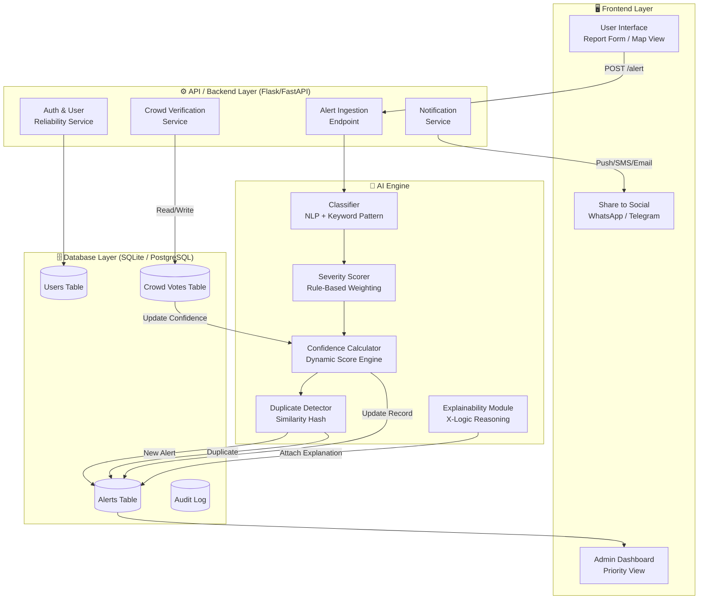
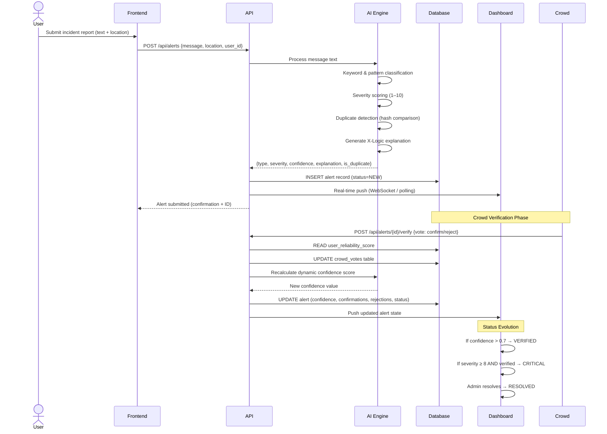

<div align="center">

# 🚨 CrisisSignal AI
### *Rapid Crisis Detection · Crowd-Verified Alerts · Real-Time Response*

[](https://developers.google.com/community/gdsc-solution-challenge)
[](https://developers.google.com/community/gdsc-solution-challenge)
[](https://sdgs.un.org/goals/goal3)
[](https://sdgs.un.org/goals/goal11)
[](https://sdgs.un.org/goals/goal16)

> **"When every second counts, CrisisSignal AI turns noise into actionable, verified, life-saving intelligence."**

</div>

---

## 📋 Table of Contents

1. [Product Vision](#-product-vision)
2. [The Problem — Raw & Unfiltered](#-the-problem--raw--unfiltered)
3. [Our Solution](#-our-solution)
4. [System Architecture](#-system-architecture)
5. [Complete System Workflow](#-complete-system-workflow)
6. [Core Features](#-core-features)
7. [Advanced Capabilities (The Winning Edge)](#-advanced-capabilities--the-winning-edge)
8. [AI Engine & Logic](#-ai-engine--logic)
9. [SDG Alignment](#-sdg-alignment)
10. [Tech Stack](#-tech-stack)
11. [Database Design](#-database-design)
12. [Setup & Demo Guide](#-setup--demo-guide)

---

## 🌟 Product Vision

CrisisSignal AI is a **real-time, AI-powered crisis response platform** designed for closed ecosystems — campuses, hospitals, hostels, and public venues. It transforms unstructured user-reported incidents into **classified, crowd-verified, severity-ranked alerts** that dashboards and responders can act upon immediately.

Unlike traditional emergency systems that rely on a single human dispatcher or a binary panic-button trigger, CrisisSignal AI introduces a **layered intelligence model** that:

- Classifies and scores alert severity using **NLP + pattern detection**
- Validates alerts through a **Crowd Verification Engine** to eliminate noise
- Tracks a **User Reliability Score** to weight trustworthy reporters higher
- Evolves each alert through a **state machine lifecycle** (New → Verified → Critical → Resolved)
- Provides **explainable AI reasoning** so responders understand *why* something is critical

This is not a distress button. This is a **smart, trustworthy, self-correcting crisis intelligence system.**

---

## 🔥 The Problem — Raw & Unfiltered

### The Scenario Nobody Talks About

> 📍 *11:42 PM. University Hostel, Block C, 3rd Floor.*
>
> A student smells smoke. She opens WhatsApp, types "there might be fire", sends it to a group of 200. Five people react with 🔥. Nobody calls the warden. Nobody knows if it's a real fire or someone leaving toast in the microwave. The warden only finds out 18 minutes later when smoke fills the corridor.
>
> A system existed. A group chat. Notifications were sent. **Nobody knew what was real.**

### Who Is Affected?

| Stakeholder | The Gap They Face |
|---|---|
| **Students / Residents** | No structured way to report; messages drown in group chats |
| **Wardens / Admins** | No prioritized, verified feed; rely on word-of-mouth |
| **Security Teams** | No real-time dashboard; respond reactively, not proactively |
| **Institutions** | Liability gaps; no audit trail of what was reported and when |

### The 4 Core Problems

1. **No Structured Reporting Channel** — Emergency info is scattered across WhatsApp, phone calls, and fragmented word-of-mouth. There's no single source of truth.
2. **No AI Triage** — Every message looks identical to a human responder. "Strange man near library" and "someone has a weapon near gate" both arrive as plain text.
3. **Fake Alert Pollution** — Even well-intentioned systems get abused. Without verification, a fake "gas leak" alert can evacuate an entire hostel unnecessarily.
4. **No Alert Evolution** — Systems that exist are static. An alert reported at 11 PM looks the same at 11:05 PM, even if 40 people confirmed it in 5 minutes.

---

## 💡 Our Solution

CrisisSignal AI addresses all four core problems with a **three-pillar architecture**:

### Pillar 1 — AI-Powered Classification Engine
A text-based AI engine that classifies incidents into **Fire, Medical, Theft, Violence, Infrastructure Failure, and General** categories, assigning a **Severity Score (1–10)** and an initial **Confidence Score (0.0–1.0)**. The engine uses keyword matching, contextual pattern detection, and urgency-phrase weighting to determine criticality.

### Pillar 2 — Crowd Verification System
Every alert enters a **crowd verification phase**. Other users near the incident (proximity-aware) or on the platform can **Confirm** or **Reject** the alert. Confirmations and rejections are weighted by the **User Reliability Score** of each voter — a first-time random user's vote carries less weight than a verified, historically accurate reporter.

### Pillar 3 — Alert Lifecycle & Smart Dashboard
Alerts are not static. They evolve:

```
[INCOMING] → [NEW] → [VERIFYING] → [VERIFIED] → [CRITICAL] → [RESOLVED]
                         ↓
                    [REJECTED] (if crowd rejects)
```

The dashboard reflects this in real-time, giving responders a **prioritized, color-coded, explainable view** of what needs immediate action.

---

## 🏗️ System Architecture



### Component Responsibilities

| Component | Technology | Role |
|---|---|---|
| **Frontend** | HTML5, CSS3, Vanilla JS | Report submission, map view, admin dashboard |
| **Backend API** | Python (Flask / FastAPI) | Business logic, routing, auth |
| **AI Engine** | Python (spaCy / regex / rule engine) | Classification, scoring, duplicate detection |
| **Database** | SQLite (dev) / PostgreSQL (prod) | Persistent alert and user storage |
| **Notification** | SMTP / Twilio / WhatsApp API | Multi-channel alert broadcasting |

---

## 🔄 Complete System Workflow

### Step-by-Step Flow



---

## ⚡ Core Features

### Base System Features

| # | Feature | Description |
|---|---|---|
| 1 | **Emergency Reporting** | Structured form with incident type, location, and free-text description |
| 2 | **AI Classification** | Automatically categorizes into Fire, Medical, Theft, Violence, Infrastructure, General |
| 3 | **Severity Detection** | Assigns a severity score (1–10) based on keywords and urgency indicators |
| 4 | **Confidence Scoring** | Initial confidence from AI; updated dynamically by crowd verification |
| 5 | **Priority Dashboard** | Admin/warden view sorted by severity × confidence — highest risk first |
| 6 | **Alert History & Audit** | Full timestamped log of all alerts and their lifecycle transitions |
| 7 | **Social Sharing** | One-click forwarding to WhatsApp / Telegram for community awareness |

---

## 🏆 Advanced Capabilities — The Winning Edge

These features transform CrisisSignal AI from a reporting tool into a **self-correcting, trust-driven crisis intelligence system**.

### 1. 👥 Crowd Verification System
> *"One voice can lie. A crowd cannot."*

When an alert is submitted, it enters a **verification window**. Nearby users are notified and can vote:
- ✅ **Confirm** — "Yes, I see it too"
- ❌ **Reject** — "This is not real / exaggerated"

Votes are **weighted by User Reliability Score** — high-trust users move the needle more.

### 2. 📊 Dynamic Confidence Score
The confidence score is **not static**. It evolves with crowd input:

```
Confidence = (AI_Base_Score × 0.4) + (Weighted_Confirmations × 0.4) + (Reliability_Bonus × 0.2)

Where:
  Weighted_Confirmations = Σ(confirm_votes × reporter_reliability) / total_voters
  Reliability_Bonus      = 0.1 if original reporter has high reliability, else 0
```

This means **an alert from a trusted reporter confirmed by many is far more actionable** than an anonymous, unconfirmed alert.

### 3. 🌟 User Reliability Score (Self-Learning Trust)
Every user has a **Reliability Score (0.0–1.0)** that adjusts over time:

- ✅ Alert confirmed by crowd → **+0.05**
- ❌ Alert rejected → **−0.10**
- 🏅 Alert escalated to CRITICAL → **+0.15**
- ⚠️ Repeated false alerts → Score degraded, alerts auto-flagged

### 4. 🔄 Alert Lifecycle State Machine

```
NEW ────────────────► VERIFYING
                          │
              ┌───────────┴──────────┐
           REJECTED             (Crowd confirms)
                                    │
                                VERIFIED
                                    │
                    (Severity ≥ 8 or admin escalation)
                                    │
                                CRITICAL ──► RESOLVED
```

Each transition is **timestamped and auditable**, giving institutions a full incident trail.

### 5. 🧠 Smart AI Explanation (X-Logic)
Every alert receives a human-readable explanation of the AI's reasoning:

> *"Classified as FIRE with HIGH severity because the message contains 'smoke', 'burning smell', and 'floor 3'. Urgency indicator 'immediately' detected. Confidence boosted to 0.82 due to 7 crowd confirmations."*

This builds **responder trust** and makes the system **interpretable**, not a black box.

### 6. 🔍 Duplicate Alert Detection
When multiple users report the same incident (e.g., 15 people all report the same fire), the system:
1. Detects similarity using **text hash comparison + location proximity**
2. **Links duplicates** to the parent alert (via `parent_alert_id`)
3. Uses the flood of reports as **additional confidence evidence** rather than noise

### 7. 🎭 Role-Based Views

| Role | View | Capabilities |
|---|---|---|
| **User / Reporter** | Submit Report + Track own alerts | See alert status, vote on others |
| **Warden / Admin** | Priority Dashboard | Verify, escalate, resolve, export report |
| **Security** | Live Map View | See all active critical alerts in real-time |

---

## 🧠 AI Engine & Logic

### Classification Engine

The AI engine uses a **three-stage pipeline**:

**Stage 1 — Keyword Matching**
```
KEYWORDS = {
  "fire":      ["fire", "smoke", "burning", "flame", "blaze"],
  "medical":   ["fainted", "unconscious", "bleeding", "ambulance", "heart"],
  "theft":     ["stolen", "theft", "robbed", "missing", "pickpocket"],
  "violence":  ["fight", "attack", "weapon", "assault", "threat"],
  "infra":     ["leak", "short circuit", "flood", "broken", "power cut"]
}
```

**Stage 2 — Urgency Amplifiers**
Phrases like *"right now", "immediately", "help", "calling police", "no one responding"* multiply the severity score.

**Stage 3 — Context Synthesis**
The engine combines category match strength + urgency weight + location sensitivity to produce:
- `alert_type` (category)
- `severity` (1–10)
- `initial_confidence` (0.0–1.0)
- `explanation` (X-Logic string)

---

## 🌍 SDG Alignment

| SDG Goal | How CrisisSignal AI Contributes |
|---|---|
| **SDG 3** — Good Health & Well-Being | Faster medical emergency detection and response on campuses |
| **SDG 11** — Sustainable Cities | Safer public spaces through community-verified alert systems |
| **SDG 16** — Peace, Justice & Strong Institutions | Transparent, auditable incident management for institutions |

---

## 🛠️ Tech Stack

```
┌──────────────────────────────────────────────────────────┐
│                    CrisisSignal AI Stack                  │
├─────────────────┬──────────────────────────────────────── │
│ Frontend        │ HTML5, CSS3, Vanilla JavaScript          │
│ Maps            │ Leaflet.js / Google Maps API             │
│ Backend         │ Python 3.11 — Flask / FastAPI            │
│ AI/NLP          │ spaCy, regex, custom rule engine         │
│ Database (Dev)  │ SQLite                                   │
│ Database (Prod) │ PostgreSQL                               │
│ Notifications   │ SMTP, Twilio SMS, WhatsApp Business API  │
│ Auth            │ JWT + session-based                      │
│ Real-Time       │ WebSocket (Socket.IO) / Long Polling     │
│ Hosting         │ Google Cloud Run / Firebase Hosting      │
└─────────────────┴────────────────────────────────────────┘
```

---

## 🗄️ Database Design

### `alerts` Table

| Field | Type | Description |
|---|---|---|
| `id` | UUID / Integer PK | Unique alert identifier |
| `message` | TEXT | Original user-reported text |
| `type` | VARCHAR | fire, medical, theft, violence, infra, general |
| `severity` | INTEGER (1–10) | AI-assigned severity score |
| `location` | VARCHAR | Campus zone / GPS coordinates |
| `confidence` | FLOAT (0.0–1.0) | Dynamic trust score |
| `confirmations_count` | INTEGER | Number of crowd confirmations |
| `rejections_count` | INTEGER | Number of crowd rejections |
| `status` | ENUM | new, verifying, verified, critical, rejected, resolved |
| `timestamp` | DATETIME | Report submission time |
| `resolved_at` | DATETIME | Time of resolution (nullable) |
| `parent_alert_id` | FK → alerts | Duplicate link to parent alert (nullable) |
| `reported_by` | FK → users | Reporter user ID |
| `explanation` | TEXT | AI-generated X-Logic reasoning |

### `users` Table

| Field | Type | Description |
|---|---|---|
| `id` | UUID / Integer PK | Unique user ID |
| `name` | VARCHAR | Display name |
| `role` | ENUM | user, admin, security |
| `reliability_score` | FLOAT (0.0–1.0) | Self-learning trust score |
| `total_reports` | INTEGER | Total alerts submitted |
| `confirmed_reports` | INTEGER | Reports confirmed by crowd |
| `rejected_reports` | INTEGER | Reports rejected by crowd |
| `created_at` | DATETIME | Account creation time |

### `crowd_votes` Table

| Field | Type | Description |
|---|---|---|
| `id` | INTEGER PK | Vote record ID |
| `alert_id` | FK → alerts | Linked alert |
| `user_id` | FK → users | Voting user |
| `vote` | ENUM | confirm / reject |
| `voted_at` | DATETIME | Vote timestamp |

---

## 🚀 Setup & Demo Guide

### Prerequisites
```bash
Python 3.11+
pip
SQLite (pre-installed)
```

### Installation

```bash
# Clone the repository
git clone https://github.com/your-username/crisisSignal-ai.git
cd crisisSignal-ai

# Create virtual environment
python -m venv venv
venv\Scripts\activate      # Windows
# source venv/bin/activate  # Linux/Mac

# Install dependencies
pip install -r requirements.txt

# Run the application
python app.py
```

### Demo Scenarios for Judges

**Scenario 1 — Verified Fire Alert**
1. Submit: *"There is smoke coming from the 3rd floor hostel staircase, smells like burning wires"*
2. Watch AI classify → **FIRE | Severity 8 | Confidence 0.61**
3. Simulate 5 crowd confirmations → Confidence rises to **0.85** → Status → **CRITICAL**

**Scenario 2 — Rejected Fake Alert**
1. Submit: *"There might be someone suspicious maybe idk"*
2. AI classifies → **GENERAL | Severity 2 | Confidence 0.30**
3. Simulate crowd rejections → Confidence drops → Status → **REJECTED**

**Scenario 3 — Duplicate Detection**
1. Submit Alert A: *"Fire on floor 3"*
2. Submit Alert B: *"Smoke on 3rd floor"*
3. System flags B as duplicate → links to A → Confirmation count on A increases

---

<div align="center">

## 🏁 Built for GDG Solution Challenge 2026

*CrisisSignal AI — Turning raw panic into structured, actionable, community-verified truth.*

</div>
